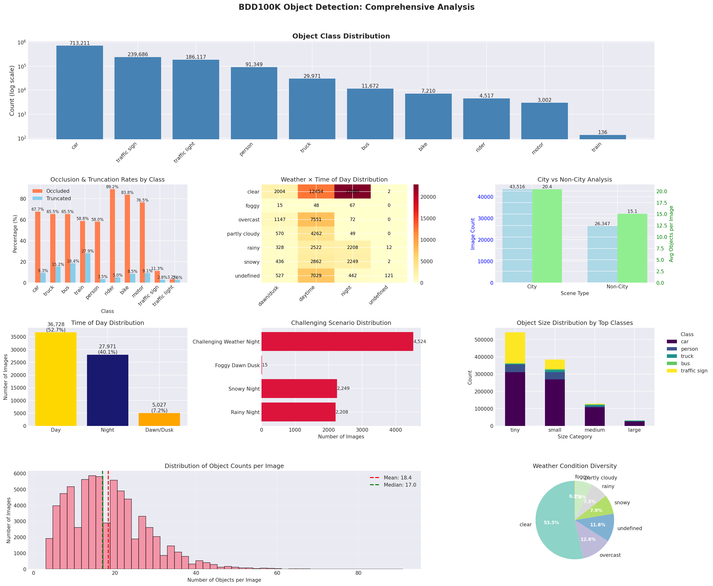
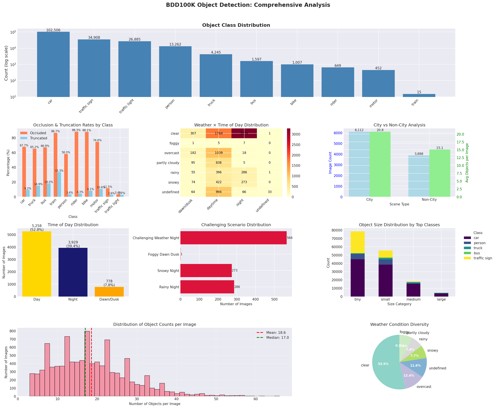

# BDD100K Object Detection Dataset Analysis Report

PART 1 - Data analysis of BDD100k dataset

The purpose of this segment is to perform some preliminary data analysis on the BDD100K dataset for the task of training an object detection model on 10 classes and share the insights gathered from this, which would help us in the next step of choosing an appropriate model for this task, either for training or directly using a pre-trained model for running inference. 

This part is divided into 2 main sections:
- one is a brief summary of the bdd100k paper and what are the key takeaways
- the next one is a report of the results of data analysis, observations/pattterns/anomalies seen in the dataset and supported visualisations.

**NOTE:**
Instructions to use docker to run the analysis script is given separately in run_docker.md file. Please follow that in order to run the script to generate the visualisations, metrics, images of interesting samples, etc. The option of running the script without docker is also available.

## Table of Contents
1. [Summary of BDD100k dataset paper](#paper-summary)
2. [Data Analysis](#data-analysis)
3. [Class Distribution Analysis](#class-distribution-analysis)
4. [Environmental Conditions](#environmental-conditions)
5. [Cross-Scenario Analysis](#cross-scenario-analysis)
6. [Anomalies and patterns](#anomalies-and-patterns)
7. [Visualizations](#visualizations)
8. [Implications](#implications-for-object-detection-training)
9. [Conclusion](#conclusion)

## 1. BDD100K Paper Summary

The BDD100K dataset, introduced by Yu et al. in "BDD100K: A Diverse Driving Dataset for Heterogeneous Multitask Learning" (CVPR 2020), represents the largest open driving video dataset with 100K videos and 10 tasks for evaluating computer vision algorithms in autonomous driving. Each video spans 40 seconds at 720p resolution and 30 fps, representing over 1,000 hours of driving experience with more than 100 million frames, collected from diverse locations across the United States including New York and San Francisco Bay Area.

### Key Dataset Characteristics:

#### Scale and Collection:
- 100,000 driving videos (40 seconds each, 30fps, 720p resolution)
- Collected from over 50,000 rides via crowdsourcing through Nexar
- Covers diverse geographical locations including New York, San Francisco Bay Area, and other US regions
- Includes GPS/IMU recordings for trajectory analysis
- Split: 70K training, 10K validation, 20K testing videos

#### Diversity Features:
- Weather conditions: clear, cloudy, overcast, rainy, snowy, foggy
- Scene types: city streets, highways, residential areas, parking lots, gas stations, tunnels
- Temporal diversity: roughly equal distribution of daytime and nighttime footage 
- Geographic diversity across populous US areas

### Major Research Findings

#### Domain Discrepancy:
- Significant performance gaps exist between different domains (city vs. non-city, daytime vs. nighttime)
- Daytime/nighttime gap is particularly large, indicating need for domain adaptation techniques
- Models trained on Cityscapes show dramatic domain shift when tested on BDD100K due to infrastructure differences

#### Multitask Learning Insights:
- Homogeneous Multitask Learning (similar output structures):
   - Joint training of lane marking and drivable area shows modest improvements
   - Benefits are more pronounced with limited training data (10K images)
   - Diminishing returns as dataset size increases

- Cascaded Multitask Learning (simple tasks helping complex ones):
   - Adding object detection annotations significantly improves instance segmentation (AP: 21.8→24.5)
   - MOT benefits from additional detection data despite having more total boxes
   - Semantic segmentation improves when jointly trained with detection

- Heterogeneous Multitask Learning (diverse task structures):
   - MOTS performance improves substantially when leveraging detection, MOT, and instance segmentation datasets
   - Segmentation AP increases from 13.0 to 23.3 through multi-task training
   - Demonstrates value of allocating annotation budget across tasks of varying complexity

### Technical Contributions
#### Benchmark Design:
- First large-scale benchmark for heterogeneous multitask learning in driving scenarios
- Tasks have varying output structures (pixel-level, region-based, temporally-aware)
- Enables study of resource allocation for annotations

#### Scale Comparisons:
- Lane marking: 70K training images (vs. previous largest ~20K)
- MOT: Order of magnitude larger than MOT17 benchmark
- MOTS: Larger than KITTI MOTS with annotation density comparable to YouTube VOS
- Object detection: More diverse than existing driving datasets

### Implications and Impact
The paper demonstrates that:
- Current models struggle with domain shifts even within driving scenarios, and we need models that are robust to domain shifts
- Heterogeneous multitask learning requires special training strategies
- Simpler task annotations can significantly boost performance on complex tasks
- Dataset diversity is crucial for robust autonomous driving systems

## 2. Data Analysis

This report analyzes the **train** split of the BDD100K object detection dataset, containing **69,863** images with **1,286,871** object annotations across 10 categories.

### Basic Statistics
**Training Split:**
- **69,863 images** with **1,286,871 annotations**
- **Average objects per image: 18.42 ± 9.62**

**Validation Split:**
- **10,000 images** with **185,526 annotations** 
- **Average objects per image: 18.55 ± 9.60**

**Key Observation:** The train-validation split maintains consistent statistics, with nearly identical object density and standard deviation, indicating a well-balanced split that preserves the dataset's distributional characteristics.

## Class Distribution Analysis

### Object Classes Summary

| Class | Train Count | Train % | Val Count | Val % | Imbalance Ratio |
|-------|------------|---------|-----------|--------|-----------------|
| **car** | 713,211 | 55.4% | 102,506 | 55.3% | **Dominant** |
| **traffic sign** | 239,686 | 18.6% | 34,908 | 18.8% | High frequency |
| **traffic light** | 186,117 | 14.5% | 26,885 | 14.5% | High frequency |
| **person** | 91,349 | 7.1% | 13,262 | 7.1% | Moderate |
| **truck** | 29,971 | 2.3% | 4,245 | 2.3% | Low |
| **bus** | 11,672 | 0.9% | 1,597 | 0.9% | Very low |
| **bike** | 7,210 | 0.6% | 1,007 | 0.5% | Very low |
| **rider** | 4,517 | 0.4% | 649 | 0.3% | Extremely low |
| **motor** | 3,002 | 0.2% | 452 | 0.2% | Extremely low |
| **train** | 136 | 0.01% | 15 | 0.01% | **Critical** |

**Severe class imbalance detected**:  Car dominates with 55% of all annotations (having 713k annotations) while train is the least with total annotations being 136 in the training set. Traffic signs,traffic lights, pedestrians form the middle-frequency classes. One implication of this would be that models will overfit to cars and underpeform on classes like train unless some sort of class balancing is used. This imbalance aligns with the paper's emphasis on the long-tail problem (ref section A.5) where they state observing the effects of this, and is already observed in the AP50/AP75 validation scores for the class train for some of the pre-trained models being 0.

**Occlusion and object sizes**: 
Riders and Bikes/motor seem to have high occlusion rates of 89% and >75% while the average rate of occlusion being around 58%. Truncation is also notable for longer objects such as busses, trucks and trains (18%, 15% and 27% respectively). 
Upon taking a look at the detailed analysis report text file, we can also see that vast majority of traffic lights and signs are small (<500 $px^2$). The average size of Traffic light is 15.9 × 25.3 pixels, and traffic signal being 32.3 × 25.2 pixels. If we take a look at the visualisation below, we can see that small and tiny objects make up for most of the data points for the top classes, thereby insiting a need for model architectures that work well with occluded as well as small/tiny objects.

**Object Size Distribution:**
- **Cars:** Average 74.6×58.0 pixels (train), 74.3×57.9 pixels (val)
- **Large vehicles (trucks/buses):** 125-145 pixel average dimensions
- **Small objects (traffic signs/lights):** 15-32 pixel average dimensions
- **Persons:** Consistently around 27-28×66-67 pixels

The dataset reveals challenging occlusion patterns that mirror real-world driving scenarios:

| Class | Train Occluded % | Val Occluded % | Analysis |
|-------|------------------|----------------|----------|
| **rider** | 89.2% | 88.3% | Critical challenge |
| **bike** | 83.8% | 88.1% | Severe occlusion |
| **train** | 58.8% | 86.7% | High variance |
| **motor** | 76.5% | 74.6% | High occlusion |
| **car** | 67.7% | 67.7% | Consistent moderate |
| **traffic sign** | 11.3% | 11.5% | Low occlusion |
| **traffic light** | 3.2% | 3.4% | Minimal occlusion |

## Environmental Conditions

### Weather Distribution

| Weather | Train % | Val % | Implications |
|---------|---------|-------|-------------|
| **clear** | 53.5% | 53.5% | Optimal conditions |
| **overcast** | 12.6% | 12.4% | Reduced lighting |
| **undefined** | 11.6% | 11.6% | Ambiguous conditions |
| **snowy** | 7.9% | 7.7% | Winter driving |
| **rainy** | 7.3% | 7.4% | Wet road conditions |
| **partly cloudy** | 7.0% | 7.4% | Variable lighting |
| **foggy** | 0.19% | 0.13% | **Severely underrepresented** |

### Scene Distribution

| Scene | Train % | Val % | Urban vs Rural |
|-------|---------|-------|----------------|
| **city street** | 62.3% | 61.1% | Dense urban |
| **highway** | 24.9% | 25.0% | High-speed rural |
| **residential** | 11.6% | 12.5% | Suburban |
| **parking lot** | 0.5% | 0.5% | Static scenarios |
| **tunnel** | 0.2% | 0.3% | Confined spaces |
| **gas stations** | 0.04% | 0.07% | Commercial |

### Time of Day Distribution

| Time | Train % | Val % | Object Density Impact | No of images |
|------|---------|-------|----------------------|------|
| **daytime** | 52.6% | 52.6% | 19.9-20.0 obj/image |
| **night** | 40.0% | 39.3% | 16.4-16.5 obj/image |
| **dawn/dusk** | 7.2% | 7.8% | Transition periods |

**Key Finding:** Night scenes contain **3.5-3.6 fewer objects per image** on average, suggesting either reduced visibility leading to fewer annotations or actual reduction in detectable objects.

## Cross-Scenario Analysis

**Challenging Weather + Night Combinations:**

| Scenario | Train Images | Val Images | % of Dataset |
|----------|--------------|------------|--------------|
| **Rainy Night** | 2,208 | 286 | 3.16% / 2.86% |
| **Snowy Night** | 2,249 | 273 | 3.22% / 2.73% |
| **Foggy Dawn/Dusk** | 15 | 1 | 0.02% / 0.01% |
| **Total Challenging** | 4,524 | 566 | 6.48% / 5.66% |

**Critical Gap:** Foggy conditions combined with dawn/dusk represent less than 0.02% of the dataset, creating a severe underrepresentation of these challenging but real-world conditions.

### City vs Non-City Analysis

- **City Streets**: 43,516 images (avg 20.4 objects/image)
- **Non-City**: 26,347 images (avg 15.1 objects/image)
- **Difference**: City scenes contain 5.4 more objects per image on average

This aligns with the paper's finding that urban environments present significantly more complex scenarios for object detection models.

## Anomalies and Patterns

### Critical Anomalies

1. **Train Class Critical Underrepresentation:**
   - Only 136 instances in training (0.01%)
   - 15 instances in validation
   - High occlusion variance (58.8% train vs 86.7% val)
   - **Risk:** Models will likely fail on train detection

2. **Foggy Weather Severe Gap:**
   - <0.2% representation across both splits
   - Real-world autonomous driving requires fog handling
   - **Risk:** Poor performance in fog conditions

3. **Size Category Imbalance:**
   - **Tiny objects:** 44,907 cars vs 241 riders (validation)
   - Size distribution heavily skewed toward tiny objects
   - **Challenge:** Small object detection performance

### Interesting Patterns

1. **Consistent Occlusion by Class:**
   - Moving objects (riders, bikes) show highest occlusion (88%+)
   - Static infrastructure (signs, lights) show lowest occlusion (<12%)
   - **Pattern:** Object mobility correlates with occlusion rates

2. **Environmental Impact on Detection:**
   - Challenging conditions reduce average objects by 2.84-2.87 per image
   - **Pattern:** Adverse weather correlates with reduced object visibility

3. **Geographic Consistency:**
   - Train-validation splits maintain nearly identical distributions
   - **Pattern:** Well-stratified sampling across environmental conditions

## Visualizations

The provided comprehensive dashboards reveal several critical insights:

1. **Object Class Distribution (Log Scale):**
   - Clear visualization of the extreme long-tail distribution
   - Car dominance is visually apparent
   - Train class appears as barely visible on the logarithmic scale

2. **Occlusion & Truncation Patterns:**
   - Rider and bike classes show consistently high occlusion across splits
   - Traffic infrastructure shows predictably low occlusion
   - Size correlation: smaller objects tend to be more occluded

3. **Weather × Time Distribution Heatmaps:**
   - Clear weather dominates across all times
   - Challenging weather-night combinations are sparse
   - Foggy conditions appear minimal across all time periods

4. **City vs Non-City Analysis:**
   - Urban scenes contain 38% more objects on average
   - Urban bias in the dataset composition (61-62%)

5. **Object Size Distribution:**
   - Heavy skew toward tiny objects across all major classes
   - Size category distribution shows long-tail pattern
   - Large objects are severely underrepresented

### Main Analysis Dashboard

*Comprehensive visualization showing class distribution, environmental conditions, and cross-scenario analysis. The top chart is for the training set wheras the bottom one is for the validation set*

## Implications for Object Detection Training

### Training Challenges

1. **Class Imbalance Mitigation Required:**
   - Focal loss or class-weighted loss functions essential
   - Oversampling strategies for rare classes (train, motor, rider)
   - Consider synthetic data augmentation for underrepresented classes

2. **Occlusion Robustness:**
   - Data augmentation with artificial occlusion necessary
   - Part-based detection approaches for highly occluded classes
   - Specialized architectures for handling partial visibility

3. **Environmental Robustness:**
   - Synthetic weather effects augmentation critical
   - Domain adaptation techniques for night/adverse weather
   - Specialized night-vision preprocessing

### Data Collection Recommendations

Based on the analysis and paper findings:

1. **Priority Collection Areas:**
   - Foggy weather conditions (critical gap)
   - Train detection scenarios (severely underrepresented)
   - Night + adverse weather combinations
   - Large object instances (buses, trucks in varied conditions)

2. **Balanced Sampling Strategy:**
   - Equal representation across weather conditions
   - Temporal balance across day/night cycles
   - Geographic diversity beyond US-centric data

### Model Training Strategy

1. **Multi-stage Training Approach:**
   - Initial training on balanced subset
   - Fine-tuning on full imbalanced dataset
   - Specialized fine-tuning for rare classes

2. **Evaluation Strategy:**
   - Class-specific metrics reporting
   - Condition-specific performance evaluation
   - Long-tail performance emphasis

## Conclusion

The BDD100K object detection dataset presents a realistic but challenging distribution that mirrors real-world autonomous driving scenarios. While the dataset's diversity in environmental conditions and scale makes it invaluable for training robust models, the extreme class imbalances and underrepresentation of certain critical scenarios (fog, trains) require careful consideration in training strategies. The consistency between train-validation splits provides confidence in model evaluation, but the identified gaps highlight areas where additional data collection or synthetic augmentation would significantly improve model performance in real-world deployment scenarios.

The analysis confirms the paper's key findings regarding domain shifts and the challenges of heterogeneous multitask learning, while providing specific, actionable insights for practitioners working with this dataset for object detection tasks.