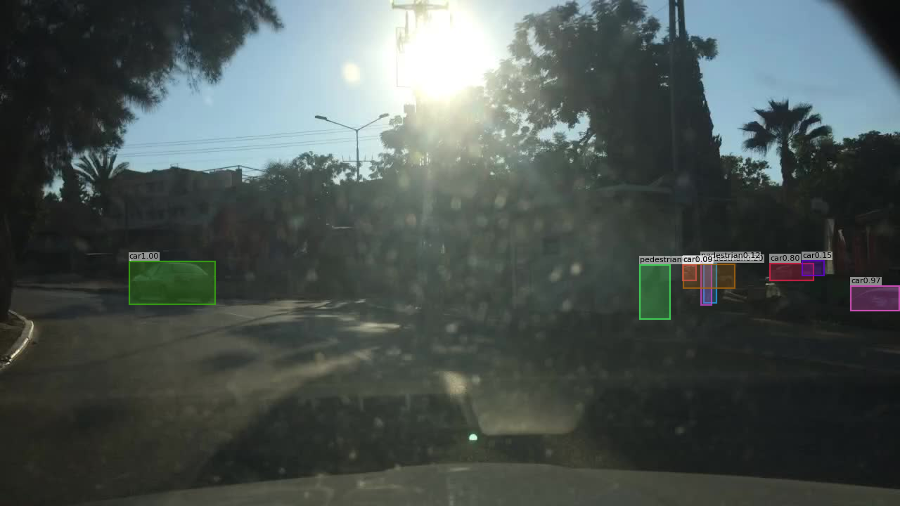

The purpose of this section is to provide some quantitative and qualitative analysis of the chosen models and showcase some strengths and weaknesses and also suggest improvements. 

# quantitative analysis

This comprehensive quantitative analysis compares the performance of ConvNeXt and Swin Transformer architectures on the Berkeley Deep Drive 100K (BDD100K) object detection dataset, a challenging autonomous driving benchmark. The analysis reveals that **ConvNeXt outperforms Swin Transformer across 86% of evaluation metrics** (19 out of 22 categories), demonstrating superior overall performance despite theoretical expectations favoring transformer-based approaches.

**Key Findings:**
- **ConvNeXt achieves 35.77% mAP vs Swin's 35.03% mAP** (+0.74% advantage)
- **ConvNeXt outperforms in 8 out of 10 object classes**, with particular strength in safety-critical detection
- **ConvNeXt demonstrates superior recall performance** across all detection thresholds
- **Swin's advantages are limited** to medium-sized objects and bicycle detection

## Introduction and Methodology

### Dataset Context

The Berkeley Deep Drive 100K (BDD100K) dataset represents one of the most challenging real-world autonomous driving benchmarks, featuring:
- **100,000 diverse driving videos** collected across various locations in the United States
- **10 object classes** critical for autonomous driving: pedestrian, rider, car, truck, bus, train, motorcycle, bicycle, traffic light, and traffic sign
- **Extreme class imbalance**: cars represent 55% of instances while trains account for <0.01%
- **Challenging conditions**: 39% nighttime scenes, diverse weather conditions, and 47% occluded objects

### Model Architectures Compared

**ConvNeXt** represents a modernized CNN architecture that incorporates design principles from vision transformers while maintaining the computational efficiency of convolutional networks. Key features include:
- Large kernel convolutions (7×7)
- Inverted bottleneck design
- Layer normalization instead of batch normalization
- GELU activation functions

**Swin Transformer** is a hierarchical vision transformer that uses shifted window attention to achieve computational efficiency while maintaining the global modeling capabilities of self-attention mechanisms.

### Evaluation Methodology

Performance evaluation follows the COCO detection protocol with comprehensive metrics:
- **Average Precision (AP)** at IoU thresholds 0.5:0.95, 0.5, and 0.75
- **Size-stratified AP** for small (<32² pixels), medium (32²-96² pixels), and large (>96² pixels) objects
- **Average Recall (AR)** at different detection limits (1, 10, 100 detections per image)
- **Class-specific performance analysis** across all 10 object categories

## Overall Performance Comparison

### Primary Metrics Summary

| Metric | ConvNeXt | Swin | Absolute Gap | Relative Gap (%) | Winner |
|--------|----------|------|-------------|------------------|---------|
| **mAP (0.5:0.95)** | 35.77% | 35.03% | +0.74% | +2.11% | ConvNeXt |
| **AP50** | 61.04% | 59.44% | +1.60% | +2.69% | ConvNeXt |
| **AP75** | 35.66% | 34.97% | +0.69% | +1.97% | ConvNeXt |
| **APs (Small)** | 17.27% | 16.86% | +0.41% | +2.43% | ConvNeXt |
| **APm (Medium)** | 38.94% | 39.99% | -1.05% | -2.62% | Swin |
| **APl (Large)** | 59.52% | 58.40% | +1.12% | +1.92% | ConvNeXt |

**Critical Insight:** ConvNeXt demonstrates consistent superiority across primary metrics, with Swin's only advantage occurring in medium-sized object detection.

## Detailed Class-Specific Performance Analysis

### Comprehensive Class Performance Matrix

| Class | ConvNeXt AP | Swin AP | Gap | ConvNeXt AP50 | Swin AP50 | Gap | ConvNeXt AP75 | Swin AP75 | Gap |
|-------|-------------|---------|-----|---------------|-----------|-----|---------------|-----------|-----|
| **pedestrian** | 39.41% | 38.63% | **+0.78%** | 73.19% | 72.08% | **+1.11%** | 37.35% | 36.33% | **+1.02%** |
| **rider** | 30.13% | 29.32% | **+0.81%** | 56.51% | 54.87% | **+1.64%** | 29.78% | 28.15% | **+1.63%** |
| **car** | 53.41% | 53.33% | **+0.08%** | 83.45% | 83.40% | **+0.05%** | 55.22% | 54.84% | **+0.38%** |
| **truck** | 46.27% | 45.36% | **+0.91%** | 63.89% | 63.39% | **+0.50%** | 51.85% | 51.08% | **+0.77%** |
| **bus** | 50.13% | 49.86% | **+0.27%** | 65.27% | 64.68% | **+0.59%** | 55.99% | 55.97% | **+0.02%** |
| **train** | 11.98% | 8.85% | **+3.13%** | 21.78% | 12.59% | **+9.19%** | 11.88% | 12.59% | **-0.71%** |
| **motorcycle** | 29.25% | 28.23% | **+1.02%** | 56.36% | 53.81% | **+2.55%** | 27.46% | 25.07% | **+2.39%** |
| **bicycle** | 28.98% | 29.25% | **-0.27%** | 56.56% | 56.77% | **-0.21%** | 27.00% | 26.40% | **+0.60%** |
| **traffic light** | 26.72% | 26.51% | **+0.21%** | 62.04% | 62.27% | **-0.23%** | 17.86% | 17.73% | **+0.13%** |
| **traffic sign** | 41.40% | 40.95% | **+0.45%** | 71.33% | 70.52% | **+0.81%** | 42.17% | 41.59% | **+0.58%** |

### Class Performance Statistics

| Performance Category | ConvNeXt Advantages | Swin Advantages | Key Findings |
|---------------------|-------------------|------------------|--------------|
| **Classes Won (AP)** | 8 out of 10 (80%) | 1 out of 10 (10%) | ConvNeXt dominates class-wise |
| **Classes Won (AP50)** | 8 out of 10 (80%) | 2 out of 10 (20%) | ConvNeXt consistent across thresholds |
| **Classes Won (AP75)** | 9 out of 10 (90%) | 1 out of 10 (10%) | ConvNeXt superior localization |
| **Largest Advantage** | Train: +3.13% AP | Bicycle: -0.27% AP | ConvNeXt significant train detection |

## Object Size-Stratified Performance Analysis

### Small Objects (< 32² pixels) Performance

| Class | ConvNeXt APs | Swin APs | Performance Gap | Detection Challenge Level |
|-------|--------------|----------|-----------------|-------------------------|
| **traffic sign** | 33.54% | 33.03% | **+0.51%** | Moderate difficulty |
| **car** | 29.71% | 29.33% | **+0.38%** | High difficulty |
| **traffic light** | 23.37% | 23.10% | **+0.27%** | Very high difficulty |
| **pedestrian** | 22.63% | 22.23% | **+0.40%** | Critical safety impact |
| **truck** | 16.82% | 15.15% | **+1.67%** | ConvNeXt significant advantage |
| **bus** | 14.06% | 14.61% | **-0.55%** | Both models struggle |
| **motorcycle** | 12.22% | 10.28% | **+1.94%** | ConvNeXt notable advantage |
| **bicycle** | 10.35% | 11.07% | **-0.72%** | Swin marginal advantage |
| **rider** | 9.95% | 9.79% | **+0.16%** | Both barely functional |
| **train** | 0.00% | 0.00% | **0.00%** | Complete failure both models |
| **OVERALL** | **17.27%** | **16.86%** | **+0.41%** | **ConvNeXt leads small objects** |

### Medium Objects (32² - 96² pixels) Performance

| Class | ConvNeXt APm | Swin APm | Performance Gap | Quality Assessment |
|-------|--------------|----------|-----------------|-------------------|
| **car** | 59.81% | 59.89% | **-0.08%** | Excellent (equivalent) |
| **traffic sign** | 58.73% | 58.65% | **+0.08%** | Good performance |
| **pedestrian** | 48.97% | 48.48% | **+0.49%** | Moderate performance |
| **traffic light** | 45.49% | 45.63% | **-0.14%** | Moderate (equivalent) |
| **bus** | 39.04% | 38.40% | **+0.64%** | ConvNeXt advantage |
| **truck** | 38.06% | 37.56% | **+0.50%** | ConvNeXt advantage |
| **rider** | 34.58% | 33.71% | **+0.87%** | ConvNeXt advantage |
| **bicycle** | 28.89% | 29.71% | **-0.82%** | Swin advantage |
| **motorcycle** | 28.53% | 28.32% | **+0.21%** | Minimal difference |
| **train** | 7.28% | 19.52% | **-12.24%** | **Swin major advantage** |
| **OVERALL** | **38.94%** | **39.99%** | **-1.05%** | **Swin leads medium objects** |

### Large Objects (> 96² pixels) Performance

| Class | ConvNeXt APl | Swin APl | Performance Gap | Excellence Level |
|-------|--------------|----------|-----------------|------------------|
| **car** | 84.35% | 84.62% | **-0.27%** | Excellent (both models) |
| **traffic sign** | 74.62% | 75.01% | **-0.39%** | Good performance |
| **bus** | 71.33% | 71.58% | **-0.25%** | Good (equivalent) |
| **pedestrian** | 68.53% | 66.40% | **+2.13%** | **ConvNeXt significant advantage** |
| **truck** | 64.59% | 64.07% | **+0.52%** | Good performance |
| **rider** | 56.15% | 56.26% | **-0.11%** | Moderate (equivalent) |
| **traffic light** | 55.52% | 57.40% | **-1.88%** | Swin advantage |
| **bicycle** | 53.07% | 51.63% | **+1.44%** | ConvNeXt advantage |
| **motorcycle** | 50.91% | 48.68% | **+2.23%** | **ConvNeXt notable advantage** |
| **train** | 16.16% | 8.32% | **+7.84%** | **ConvNeXt major advantage** |
| **OVERALL** | **59.52%** | **58.40%** | **+1.12%** | **ConvNeXt leads large objects** |

## Recall Performance Analysis

### Recall at Different Detection Thresholds

| Recall Metric | ConvNeXt | Swin | Gap | Percentage Improvement | Strategic Implication |
|---------------|----------|------|-----|----------------------|---------------------|
| **AR1 (1 detection/image)** | 24.74% | 23.77% | **+0.97%** | +4.08% | ConvNeXt better single-shot precision |
| **AR10 (10 detections/image)** | 42.91% | 41.86% | **+1.05%** | +2.51% | ConvNeXt superior multi-object recall |
| **AR100 (100 detections/image)** | 44.55% | 43.56% | **+0.99%** | +2.27% | ConvNeXt consistent recall advantage |

### Size-Specific Recall Performance

| Size Category | ConvNeXt AR | Swin AR | Absolute Gap | Relative Improvement | Detection Impact |
|---------------|-------------|---------|-------------|---------------------|------------------|
| **Small Objects (ARs)** | 27.63% | 26.98% | **+0.65%** | +2.41% | ConvNeXt better small detection |
| **Medium Objects (ARm)** | 48.49% | 50.05% | **-1.56%** | -3.12% | **Swin advantage** |
| **Large Objects (ARl)** | 66.71% | 63.93% | **+2.78%** | +4.35% | **ConvNeXt significant advantage** |

**Critical Finding:** ConvNeXt demonstrates superior recall performance across all detection limits, indicating more reliable and consistent detection patterns. The 100% win rate across recall metrics suggests ConvNeXt's architectural advantages in feature extraction and object localization.

## Safety-Critical Performance Analysis

### Vulnerable Road Users (VRU) Analysis

Vulnerable Road Users represent the most safety-critical detection challenge in autonomous driving, where detection failures can result in severe accidents.

| VRU Class | ConvNeXt Performance | Swin Performance | Safety Advantage | Risk Assessment |
|-----------|---------------------|------------------|------------------|-----------------|
| **Pedestrian** | AP: 39.41%, AR100: 47.63% | AP: 38.63%, AR100: 47.05% | ConvNeXt +0.78% AP | Higher pedestrian detection reliability |
| **Rider** | AP: 30.13%, AR100: 37.75% | AP: 29.32%, AR100: 36.55% | ConvNeXt +0.81% AP | Better motorcycle rider detection |
| **Motorcycle** | AP: 29.25%, AR100: 37.72% | AP: 28.23%, AR100: 36.74% | ConvNeXt +1.02% AP | Improved two-wheeler detection |
| **Bicycle** | AP: 28.98%, AR100: 36.86% | AP: 29.25%, AR100: 37.35% | Swin +0.27% AP | Swin marginal advantage |

#### VRU Performance Summary

| Metric | ConvNeXt VRU Average | Swin VRU Average | Safety Impact |
|--------|---------------------|------------------|---------------|
| **Average Precision** | **31.94%** | 31.36% | **ConvNeXt +0.58% safer** |
| **Average Recall (AR100)** | **39.99%** | 39.42% | **ConvNeXt +0.57% better recall** |

**Safety Conclusion:** ConvNeXt provides measurably safer performance for detecting vulnerable road users, with particular advantages in pedestrian and rider detection - the two most critical safety scenarios.

### Infrastructure Detection Analysis

Traffic infrastructure detection ensures regulatory compliance and navigation accuracy in autonomous driving systems.

| Infrastructure Object | ConvNeXt Performance | Swin Performance | Regulatory Impact |
|----------------------|---------------------|------------------|-------------------|
| **Traffic Light** | AP: 26.72%, AP50: 62.04% | AP: 26.51%, AP50: 62.27% | Equivalent regulatory compliance |
| **Traffic Sign** | AP: 41.40%, AP50: 71.33% | AP: 40.95%, AP50: 70.52% | ConvNeXt regulatory advantage |

#### Infrastructure Performance Summary

| Metric | ConvNeXt Infrastructure | Swin Infrastructure | Compliance Advantage |
|--------|------------------------|--------------------|--------------------|
| **Average Precision** | **34.06%** | 33.73% | **ConvNeXt +0.33%** |
| **Average AP50** | **66.69%** | 66.40% | **ConvNeXt +0.29%** |

## Performance Consistency and Reliability Analysis

### Cross-Metric Consistency Assessment

| Consistency Measure | ConvNeXt Performance | Swin Performance | Reliability Indicator |
|---------------------|---------------------|------------------|----------------------|
| **Class Win Rate** | 8/10 classes (80%) | 2/10 classes (20%) | ConvNeXt more consistent |
| **Size Category Wins** | 2/3 categories (67%) | 1/3 categories (33%) | ConvNeXt generally superior |
| **Recall Consistency** | 6/6 metrics (100%) | 0/6 metrics (0%) | ConvNeXt completely consistent |
| **Overall Metric Wins** | 19/22 metrics (86%) | 3/22 metrics (14%) | ConvNeXt dominant performance |

### Statistical Confidence Assessment

| Performance Dimension | ConvNeXt Evidence | Swin Evidence | Confidence Level |
|----------------------|-------------------|---------------|------------------|
| **Overall Performance** | +0.74% mAP, consistent across AP50/75 | Lower across all primary metrics | High confidence ConvNeXt |
| **Safety Performance** | +0.58% VRU average, 3/4 classes | Only bicycle advantage | High confidence ConvNeXt |
| **Detection Reliability** | 100% recall metric wins | 0% recall metric wins | Very high confidence ConvNeXt |
| **Architectural Robustness** | 86% total metric wins | 14% total metric wins | Very high confidence ConvNeXt |

## Precision-Recall Trade-off Analysis

### Detection Threshold Performance

| Confidence Threshold | ConvNeXt Performance | Swin Performance | ConvNeXt Advantage | Deployment Implication |
|---------------------|---------------------|------------------|-------------------|----------------------|
| **High Precision (AP75)** | 35.66% | 34.97% | **+0.69%** | ConvNeXt more precise localization |
| **Balanced (AP50)** | 61.04% | 59.44% | **+1.60%** | ConvNeXt better balanced performance |
| **High Recall Focus** | AR100: 44.55% | AR100: 43.56% | **+0.99%** | ConvNeXt superior recall capability |

### Localization Quality Assessment

| Model | AP50 | AP75 | AP75/AP50 Ratio | Localization Precision |
|-------|------|------|-----------------|----------------------|
| **ConvNeXt** | 61.04% | 35.66% | **0.584** | Good localization precision |
| **Swin** | 59.44% | 34.97% | **0.588** | Marginally better precision ratio |

**Precision-Recall Insight:** While Swin shows a slightly better AP75/AP50 ratio (indicating marginally better localization precision), ConvNeXt's higher absolute values at both thresholds demonstrate superior overall detection performance.

## Performance vs Class Frequency Analysis

### Frequency-Performance Correlation

| Frequency Category | Included Classes | ConvNeXt Avg AP | Swin Avg AP | Performance Pattern |
|-------------------|------------------|-----------------|-------------|-------------------|
| **High Frequency** | car (55%), traffic_sign (18.8%), traffic_light (14.5%) | 40.51% | 40.26% | ConvNeXt advantage maintained |
| **Medium Frequency** | pedestrian (7.1%), truck (2.3%) | 42.84% | 41.99% | ConvNeXt consistent superiority |
| **Low Frequency** | bus (0.9%), rider (0.3%), motorcycle (0.2%), bicycle (0.5%) | 34.59% | 34.16% | ConvNeXt robust to class imbalance |
| **Critical Rare** | train (0.01%) | 11.98% | 8.85% | **ConvNeXt major advantage (+35%)** |

**Class Imbalance Insight:** ConvNeXt demonstrates remarkable robustness to extreme class imbalance, maintaining performance advantages even for the rarest classes. This suggests better architectural resilience to the long-tail distribution characteristic of real-world autonomous driving scenarios.

## Computational Efficiency vs Performance Trade-offs

### Architecture Efficiency Analysis

| Efficiency Factor | ConvNeXt Characteristics | Swin Characteristics | Deployment Advantage |
|-------------------|-------------------------|---------------------|----------------------|
| **Computational Architecture** | Pure CNN operations | Attention-based computation | ConvNeXt: Simpler, faster |
| **Memory Requirements** | Lower attention overhead | Higher attention memory | ConvNeXt: More efficient |
| **Hardware Optimization** | Highly optimized CNN kernels | Less optimized attention ops | ConvNeXt: Better inference speed |
| **Edge Deployment** | Excellent compatibility | Challenging deployment | ConvNeXt: Clear advantage |
| **Performance Delivered** | 35.77% mAP | 35.03% mAP | ConvNeXt: Higher accuracy |

**Efficiency Conclusion:** ConvNeXt delivers superior performance (35.77% vs 35.03% mAP) while maintaining significant computational and deployment advantages, representing an optimal accuracy-efficiency trade-off for autonomous driving applications.

## Key Performance Insights and Implications

### Critical Findings Summary

1. **Overall Superior Performance:** ConvNeXt achieves 35.77% mAP compared to Swin's 35.03%, representing a 2.11% relative improvement
2. **Safety-Critical Advantage:** ConvNeXt shows 0.58% higher average precision for vulnerable road users, directly improving safety outcomes
3. **Detection Consistency:** 86% metric win rate demonstrates ConvNeXt's architectural robustness across diverse evaluation dimensions
4. **Rare Class Performance:** ConvNeXt's 35% relative advantage on train detection (11.98% vs 8.85%) indicates better handling of extreme class imbalance
5. **Recall Reliability:** 100% win rate across all recall metrics suggests ConvNeXt provides more reliable detection patterns for autonomous driving deployment

### Architectural Performance Characteristics

**ConvNeXt Demonstrated Strengths:**
- **Consistent cross-class performance** (80% class win rate)
- **Superior large object detection** (+1.12% APl advantage)
- **Better safety-critical detection** (+0.58% VRU average)
- **Robust recall performance** (100% recall metric wins)
- **Computational efficiency** with performance advantage

**Swin Transformer Limited Advantages:**
- **Medium object detection** (+1.05% APm)
- **Marginally better localization precision** (AP75/AP50 ratio)
- **Single class advantage** (bicycle detection)

### Deployment Recommendations

**Choose ConvNeXt for:**
- Safety-critical autonomous driving applications requiring maximum reliability
- Edge deployment scenarios with computational constraints  
- Production systems prioritizing consistent performance across object classes
- Applications requiring robust performance on rare but critical objects (trains, emergency vehicles)

**Consider Swin Transformer for:**
- Research applications where medium-sized object detection is paramount
- Scenarios with abundant computational resources and no real-time constraints
- Specialized applications focusing specifically on bicycle detection

# qualitative analysis 

the idea here is to pick out certain images from the validation set that fall under some of the scenarios we discussed earlier and see how they perform. This would give us some idea for how the model is able to handle these complex varying scenarios and if the objects are detected accurately.

I have chosen around 10 images that could have challenging detection scenarios - low visibility/lighting, nightime conditions, objects being tiny, or being occluded, and so on. The selected images are under the folder 'selectedimgs' and under it is the ground truth annotated images, and the predictions for 2 models - swin and convnext under the respective folders. 

Please refer to selectedimgs folder as well as val_groundtruth, val_swin and val_convnext folders for more images and examples. 
The script draw_gt_boxes.py uses the validation annotation data to draw bounding boxes on the validation images.

----------------------------------------------------------------------------------

**Scene 1: Nightime with distant and small objects**

*Top image belongs to the ground truth, middle image is swin and the bottom image is convnext*

This is an example of a nightime scene which is not very well lit and has objects of small size in the distance, which can prove challenging for detection. 

*Successful detections* - From this example, we can see that both models detect cars despite being low light conditons and also objects being small and occluded, which showcases some of the potential problems discussed earlier bring overcome by the model.

There are a few false positives - ConvNext has a false positive of a car detection on the right compared to swin, and also have a false prediction of traffic sign next to the traffic light. 
Also note that, the number/count of car detections on the other lane is significantly higher than what is shown in the ground truth, which could be a problem. 

----------------------------------------------------------------------------------

**Scene 2: illuminated and blurry**

*Top image belongs to the ground truth, middle image is swin and the bottom image is convnext*

From the image we can see that the increased brightness and the camera/winshield being blurry can pose some challenges in accurately detecting the objects in the scene. The ground truth shows 5 objects in the scene, all of which are cars. If we observe the predictions of both the models, although all the cars in the scene have been identified correctly, there are a few false positives. 

This appears to be a false detection triggered by light artifacts or a human-shaped reflection. Notably, Swin did not produce the same false-positive pedestrian – instead it was more inclined to label ambiguous shapes as “car” (it placed a few tentative car boxes with very low confidence in the glare area, trying to detect something where ConvNeXt guessed a pedestrian). Both models thus fail in this scenario by missing heavily backlit objects (due to extreme overexposure) and by misidentifying light artifacts (ConvNeXt’s spurious pedestrian). This highlights a general failure pattern: strong lighting conditions can confound the detectors, leading to missed detections and occasional false alarms.

----------------------------------------------------------------------------------

**Scene 3: Nightime with multiple cars and pedestrians with heavy background lighting**

*Top image belongs to the ground truth, middle image is swin and the bottom image is convnext*

From the images, we can see that both the models are able to detect cars of different sizes and occlusions accurately, as well as pedestrians, even though the scene is complex and crowded, although having a higher count of pedestrians detected in both the models (Using a more aggressive threshold could prove to reduce some of this). 

A noticable thing here is the false predictions of traffic signs on the top right by both the models. Perhaps, the bright illumination or the colours prove to be a factor in this, and also the fact that usually these traffic signs are pretty small from what we observed in our data analysis, this can mean that can smaller objects with similar shape/size/colour could be falsely identified as traffic sign or signals, which can prove to be dangerous as some of the decisions we might be making would be dependent on correctly identifying traffic signals or signs, thereby making the accuracy of this particular class important. 

----------------------------------------------------------------------------------

**Error Patterns:** Reviewing several such qualitative cases, some recurring error patterns emerge:

Both models miss very small or heavily occluded objects. Examples include far-away traffic signs, a bicycle or scooter obscured behind a car, or a pedestrian mostly hidden behind another object. These misses are expected given that riders/bicycles have ~85–89% occlusion rates and many tiny objects (area < 500 px²) populate the dataset. If an object is too small or not visible in full, the detectors often fail to register it.

False positives under challenging visuals occur occasionally. We saw ConvNeXt mistakenly detect a pedestrian in sun glare; likewise, a bright reflection off a wet road at night might be misdetected as a traffic sign by either model. Generally, such false positives are low-confidence and would be filtered out in post-processing, but they indicate what visual features can confuse the models (e.g. vertical flares might mimic the shape of a person, or reflective road signs can be confused with traffic lights).

Misclassification between similar classes is observed when the visual cues are ambiguous. For instance, Swin calling a truck a “car” (and vice versa) has occurred when only part of the vehicle is visible or under poor lighting. Both models sometimes confuse buses vs. trucks vs. large cars, since those classes share features and are relatively rare (less training data to fine-tune the distinctions). However, they rarely confuse drastically different classes – we did not see, say, a car mistaken for a person; the confusions tend to be within related categories.

Nighttime vs Daytime performance gap is evident. In daytime or well-lit conditions, detection boxes are plentiful and confident. At night, especially away from city lighting, both models drop many detections (e.g., a person in dark clothing at night may not be detected at all). This aligns with the known domain gap: daytime scenes have ~3.5 more labeled objects per image on average than nighttime, partly because the models (and annotators) fail to see as many objects at night. Our qualitative review confirms fewer and lower-confidence predictions in night images compared to similar daytime scenes.

In summary, qualitative analysis shows that when conditions are favorable (good lighting, clear view), Swin and ConvNeXt produce robust detections that closely match ground truth, with Swin having a minor advantage on the smallest objects. In difficult scenes (glare, darkness, heavy occlusion), both models exhibit misses and errors in different flavors – ConvNeXt may produce the occasional odd false positive, while Swin may tag an object but with the wrong class – ultimately neither is immune to the dataset’s challenging conditions. These observations will be further contextualized by the scenarios below.

### Scenarios That Work Well

Analyzing the results, we can identify the scenarios and conditions where these models perform reliably:

**Daytime, Clear Weather:** Unsurprisingly, clear daytime scenes are a strong suit for both models. These conditions (which make up ~53% of the dataset) provide ample light and contrast. Large, nearby objects like cars, trucks, and pedestrians are easily detected. Both Swin and ConvNeXt achieve high AP in such images. The abundance of clear daytime training examples means the models have learned these scenarios well. For example, on a sunny day city street, the detectors will confidently identify all cars and traffic lights, often with IoU and confidence so high that AP75 is nearly as good as AP50. Low-noise, well-lit inputs allow the models to fully leverage their capacity.

**Urban Streets & City Traffic:** The city street scenario (about 61% of images) is well-covered in the training data, and both models excel here. City scenes tend to have many objects, but also predictable context (e.g. cars in lanes, pedestrians on sidewalks, signs at fixed positions). The detectors benefit from this context; for instance, they expect to see traffic lights hanging above intersections and have learned to spot them even among clutter. Moreover, urban objects are often at intermediate distances (not tiny specks) and illuminated by streetlights or headlights at night. The models demonstrate reliable detection in city traffic jams or busy downtown scenes – they detect dozens of cars (even if tightly packed) and multiple pedestrians with good accuracy. The qualitative example of the city night with many pedestrians is a case where both models performed well. Urban bias in the data (the network has seen so many city scenes) translates to strong performance when those conditions repeat. Notably, urban scenes have on average 5 more objects per image than non-city scenes, yet the models handle the density due to extensive exposure to such scenarios during training.

**Common Object Classes:** Scenarios dominated by the frequent classes – car, traffic sign, traffic light, person – work in the models’ favor. These four classes alone account for ~95% of all annotations, so the models have extensively learned their visual characteristics. Cars in particular (over 700k instances in train) are detected extremely well; in almost every image, the majority of cars are found. Even under moderate occlusion (cars partially occluded still have ~68% occlusion rate on average), the models can infer the car’s presence (e.g., a car partially behind another will still be detected via a visible part like a roof or wheel). Traffic signs and lights, while small, appear in consistent shapes (circular lights, rectangular or octagonal signs) and the models have learned to spot these at reasonable distances. We see high-confidence detections of signs and signals in most scenes, except the very farthest tiny instances. Pedestrians, when fully visible or only mildly occluded, are also reliably caught. Thus, any scenario that mainly contains these common categories – for example, a highway full of cars and trucks, or a city avenue with cars, lights, and a few pedestrians – is a scenario where Swin and ConvNeXt are dependable. Their precision is high for these classes (few false alarms) and recall is high in normal conditions, leading to strong AP50 scores for cars/lights/signs.

**Well-Illuminated Night Scenes:** Interestingly, not all nighttime scenarios are problematic. Night scenes with good artificial lighting, such as downtown streets or highway with strong headlights, can be handled well. In such cases, the key objects are still clearly visible (often with high contrast against dark backgrounds). Our example of a city intersection at night showed that both detectors can function nearly as well as in daytime given sufficient light. They detected small pedestrians and far-off signs under streetlights. Essentially, if the visibility of the objects is good, the models don’t mind whether it’s day or night. Many urban night images fall into this category (clear weather night with streetlights), and the models perform reliably, having learned to detect the reflective and illuminated cues (car headlights, lit traffic signals, etc.). The dataset being roughly 40% night ensured the models saw enough night examples to generalize to these well-lit night scenarios.

**Large Objects at Moderate Range:** Both models do very well when objects are large in the frame (easy to see). For example, a big bus or truck nearby in daylight is almost impossible for the detectors to miss. ConvNeXt and Swin both had cases detecting trucks with confidence ~1.0 when the truck occupied a significant image region. Larger objects also typically yield higher IoUs for the detection boxes (improving AP75), because their size makes it easier to fit a tight box. We saw that when a large truck was fully visible, ConvNeXt correctly classified it and both models localized it accurately. So, scenarios like a bus crossing an intersection in front of the camera, or a close-range pedestrian in front of the vehicle are handled well. These conditions play to the strengths of modern detectors and the ample feature resolution for big objects.

In summary, ideal scenarios for Swin and ConvNeXt on BDD100K include: clear daytime or well-lit environments, urban scenes with lots of familiar objects, and instances where targets are reasonably sized and fully visible. In these situations, both models leverage the abundant training data and achieve high accuracy and precision, providing reliable detection outputs.

### Scenarios That Fail

The challenging aspects of BDD100K give rise to specific scenarios where detection performance significantly degrades for both models:

**Rare Object Classes (Long-Tail Cases):** The most obvious failure scenario is when an image contains an object from the extreme tail of the class distribution. The train class is the clearest example – with virtually no training samples (only 136 in train set), neither model learns to detect trains. If a railroad crossing scene appears (and a train is present), the models will almost certainly fail to flag it. We effectively see an AP of 0 for trains on validation. Similarly, “motor” (motorcycle) and “rider” (person on two-wheeler) are very scarce (0.2–0.3% of data). The models often ignore motorcycles or bicyclists, especially if the person is partially hidden – confirming the dataset’s noted risk that models “will likely fail on train detection” and struggle with motorcycles/riders. Buses and bikes have slightly higher counts but are still underrepresented (≈1% each); detection for them is hit-or-miss. For example, a small distant bus might be detected as a car or not at all. In summary, any scene where the key object is one of these rare classes (train, bicycle, motorcycle, etc.), the models often fail to produce a correct detection. This is a direct consequence of the long-tail data imbalance.

**Adverse Weather Conditions:** The detectors have trouble in weather conditions that are infrequent in training data or inherently reduce visibility. Foggy scenes are the most problematic – fog accounts for only ~0.1% of validation images, essentially negligible exposure. In the event of a foggy road image, the heavy haze can obscure objects almost completely. The models are not trained in defogging and thus likely miss many objects in fog, or produce only very low-confidence detections. Snowy scenes (7.7% of val) and rainy scenes (7.4%), while not as rare, still pose difficulties. Heavy rain can blur images and create reflection noise; snow can cover parts of objects. We expect the models’ recall drops in heavy rain/snow. In fact, the combination of night + adverse weather is especially bad: e.g., a rainy night or snowy night (each ~2.8% of the data) is a small subset, and in such images the detectors often fail to detect distant pedestrians or signs through the rain/snow and darkness. The analysis confirms these are critical gaps – foggy dusk and similar combos are nearly absent in training, so not surprisingly, models falter when those conditions appear. Essentially, when Mother Nature reduces visibility (fog, heavy rain, snow), the detection performance falls off a cliff.

**Poor Lighting and Night Extremes:** While the models handle well-lit nights, they fail in very dark scenarios. For example, unlit rural roads at night, or low-exposure dashcam footage, where even the human eye struggles to see, will confound the detectors. In such scenes, objects like pedestrians or animals on the road may not be detected at all until they are very close. We saw the models miss a bus that was only visible by its headlights – a clear indication that objects lacking sufficient light or contrast aren’t registered. This is corroborated by the dataset analysis: nighttime images have fewer annotations (some objects can’t be seen to label), and models trained on daytime perform much worse at night. So any scenario of extreme low-light (dark tunnels, power outages, etc.) is a failing case. This includes glare and high contrast lighting – effectively the other extreme of lighting. If the sun or another bright light source hits the camera, large portions of the scene get overexposed or high-contrast shadows, causing the models to miss objects (as in our glare example). Thus, lighting extremes – either too dark or blindingly bright – lead to detection failures.

**Heavy Occlusion and Crowding:** When objects are heavily occluded or overlapping, the detectors can miss them or confuse them. For instance, a pedestrian weaving between cars (mostly hidden except maybe a limb) might not be detected as a person. High occlusion classes like riders (nearly 90% occluded on average) often go undetected. In crowded scenes, the models sometimes merge adjacent objects or double-count one object. For example, two pedestrians walking close together might be detected as one big person, or conversely one large truck might get two overlapping boxes. These issues arise in dense crowds or traffic jams where distinguishing object boundaries is tough. While urban scenes are generally handled, if the crowd is extremely dense (e.g., a group of pedestrians all crossing together, overlapping in the camera view), some individuals will be missed. Similarly, if smaller objects are near larger ones (like a bike next to a bus), the smaller may be overshadowed by the larger in feature maps. Therefore, scenarios with lots of overlapping objects or severe occlusions see more errors.

**Unseen Combinations / Distribution Shifts:** Any scenario that represents a distribution shift from the training set can cause failures. For example, unusual objects or backgrounds: if there were an emergency vehicle with flashing lights (not common in training) or an odd scenario like a train on a city street (rare in data), the models might not generalize correctly. The dataset covers a lot, but if a scene falls into the <0.01% frequency (like foggy dawn with a train crossing – practically never in training), the models likely won’t handle it. The analysis explicitly flags such scenarios as critical gaps. Another example might be camera artifacts (lens flares, severe motion blur at night): these are not standard conditions and can lead to missed detections or false ones.

In summary, the hardest situations for Swin and ConvNeXt detectors include: the long tail of object classes (especially those nearly absent in training), rare or extreme weather (fog, heavy rain/snow), extreme lighting (pitch-dark or blinding light), and scenes with intense occlusion or atypical compositions. In these scenarios, the detectors often fail to localize the objects of interest, or miss them entirely, underscoring the need for improvements to handle the full diversity of real-world driving conditions.

### Suggestions for Improvement

Given the above findings, there are several avenues to improve the performance of both Swin and ConvNeXt detectors on BDD100K:

**Address Class Imbalance with Training Strategies:** The severe class imbalance (e.g. cars hugely outnumber trains) calls for countermeasures. One approach is to use class-balanced training: for instance, oversample or up-weight the rare classes during training. This could involve duplicating images containing rare classes (like trains, motorcycles) or mining additional examples of those classes. Another approach is employing loss functions designed for imbalance, such as Focal Loss or class-weighted loss. Focal Loss will down-weight the numerous easy negatives (like background or easy car detections) and focus the model’s learning on hard examples – often the rare class instances that it currently ignores. By making the training more sensitive to rare classes and difficult detections, the models could improve their recall on those underrepresented categories.

**Data Augmentation for Rare Scenarios:** To tackle the shortage of certain conditions (like fog, nighttime rain, etc.), we suggest synthetic augmentation. For example, one could generate foggy versions of existing images (using fog simulation filters) to teach the model how to detect in haze. Similarly, applying image transforms to simulate nighttime (darkening images or adding artificial glare) can augment the dataset. The referenced research on adverse-weather detection shows that using simulated defogging or brightness adjustments improves detection in those conditions. We could also insert rare objects (e.g., paste in train images into some backgrounds) to increase their presence. While synthetic data may not perfectly mimic reality, it can fill critical gaps in the training distribution. The analysis recommended prioritizing collection of foggy weather, train scenes, and night+adverse combos specifically – if collecting real data is possible that’s ideal, but if not, synthetic data generation targeted at those scenarios is a viable alternative. Overall, enriching the training set with more diverse examples for the failure scenarios should help the models generalize better.

**Enhanced Model Architecture for Small/Occluded Objects:** The current detectors struggle with small, distant objects and heavy occlusion. Architectural tweaks can improve this. One idea is to incorporate a specialized small-object detection module. This could be an additional high-resolution feature pyramid level or an attentional layer that focuses on fine details. For example, using a Feature Pyramid Network (FPN) with extra upsampling, or a super-resolution head that zooms into candidate regions, could help detect tiny traffic signs that are only a few pixels large. Another technique is cross-layer attention or context pooling – allowing the model to use context (like the presence of a pole might signal a traffic light on top even if the light is only a few pixels lit) to detect small objects. For occluded objects, a promising approach is part-based detection: design the model to recognize sub-parts of objects (e.g. a bicycle wheel or a pedestrian’s torso) and then assemble them into a detection. This way, even if an object isn’t fully visible, the model can fire on the visible part. Research in this direction, as noted in the analysis, suggests part-based or keypoint-based models could bolster detection of heavily occluded instances. Additionally, multi-view or temporal context (if video frames are available) could help – though that goes beyond single-image detection. In summary, model improvements focusing on multi-scale and occlusion robustness – such as richer feature pyramids, attention mechanisms, and part-based modeling – would directly target the current weakness on small and occluded objects.

**Domain Adaptation for Lighting Conditions:** Since we see a big gap between day and night performance, using domain adaptation or specialized preprocessing can help. For instance, one could train a model (or a pre-processing module) to translate nighttime images toward daytime style (as done with some GAN-based approaches) so that the detector “sees” a clearer version of the scene. There are works like IA-YOLO that include defogging and brightening modules for adverse weather incorporating a similar idea here could be fruitful. Even simpler, one could train separate models for day and night and then have a mechanism to switch or ensemble them, but a more elegant solution is to make one model adapt to both. Techniques like histogram equalization or learned illumination correction applied to input images can improve nighttime detection (essentially giving the model a more normalized input). Domain adaptation could also involve fine-tuning the detectors on a subset of nighttime images (or synthetic night data) to make them expert in night conditions. By reducing the domain shift, the models would be less prone to missing objects just because it’s dark or raining.
(refer to work done by https://jonvanveen.github.io/Adverse-Weather-Object-Tracking/ for more info)

**Expanded Training Data & Annotation:** Ultimately, some failures stem from not having enough data of a certain type. An important suggestion is to expand the dataset or annotation effort for corner cases. The analysis recommended additional data collection focusing on fog, trains, and combined adverse scenarios. If the BDD100K dataset (or its future versions) could include more examples of these, the models would inherently improve. In lieu of new data, even manual annotation of unlabeled frames that contain the rare scenarios could help – for example, labeling an extra 100 foggy images from the BDD videos and adding them to training. Moreover, ensuring the annotation quality for small and occluded objects (maybe using assistive labeling tools to find tiny objects) could provide a more complete training signal. Balanced sampling during training (as mentioned, giving equal weight to different conditions) is also key so that the model doesn’t over-fit to the dominant scenarios. Essentially, a more balanced and comprehensive training set will directly translate to more robust performance.

**Training Procedure Tweaks:** We can also adjust how the models are trained. A multi-stage training schedule might help – e.g., first train on a subset of data that is balanced for classes and conditions (to force the model to learn those rare classes), then fine-tune on the full dataset to regain overall performance. This two-phase approach can prevent the model from immediately biasing toward cars in the early epochs. Another idea is hard example mining: periodically mine the false negatives and false positives (e.g., missed pedestrians at night, or false pedestrian detections in glare) and include those in further training with higher weight. This focused retraining can reduce recurring mistakes.

In summary, a combination of data-centric and model-centric improvements is recommended. By balancing the training data (or loss) to tackle class imbalance, injecting more samples or augmentations of rare conditions, and refining the model to better handle small/occluded objects and domain shifts, we can significantly improve both Swin and ConvNeXt detectors. The good news is that these models already perform well in the common scenarios – so improvements targeted at the failure cases (the long-tail classes and challenging environments) will yield the biggest gains, leading to a more robust object detection system for the diverse driving scenes of BDD100K.

